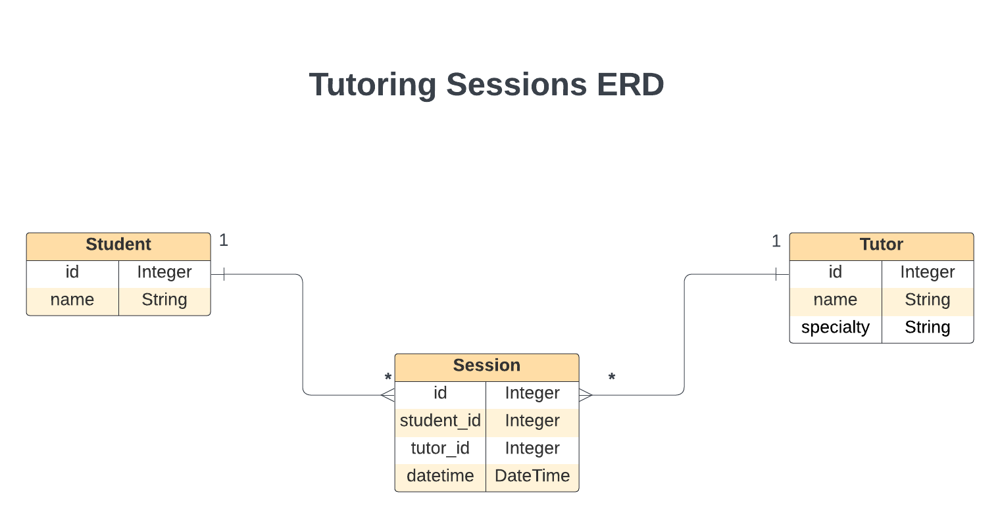

# Flask Mock Challenge - Tutoring Sessions

You are
building a website for students to book tutoring sessions with tutors.

In this repo:

- There is a Flask application with some features built out.

---

```

You can run your Flask API on [`localhost:5555`](http://localhost:5555) by
running:

```console
python server/app.py
```
```

---

## Models

It is your job to build out Student, Tutor, and Session models so that
students can book tutoring sessions with tutors. **In a given session, one student will
have a tutoring session with one tutor**. Overtime, **students will have many tutors**
and **tutors will tutor many students**.

You will implement an API for the following data model:



The file `server/models.py` defines the model classes **without relationships**.
Use the following commands to create the initial database `app.db`:

```console
export FLASK_APP=server/app.py
flask db init
flask db upgrade head
```

Now you can implement the relationships as shown in the ER Diagram:

- A `Tutor` has (tutors) many `Students` through `Session`s
- A `Student` has (is tutored by) many `Tutor`s through `Session`s
- A `Session` belongs to a `Tutor` and belongs to a `Student`

Update `server/models.py` to establish the model relationships. Since a
`Session` belongs to a `Tutor` and a `Student`, configure the model to
cascade deletes.

Set serialization rules to limit the recursion depth.

Run the migrations and seed the database:

```console
flask db revision --autogenerate -m 'message'
flask db upgrade head
python server/seed.py
```

> If you aren't able to get the provided seed file working, you are welcome to
> generate your own seed data to test the application.

---

---

## Validations
Add validations to the `Student` model:

- must have a `name`

Add validations to the `Tutor` model:

- must have a `name`, and a `specialty`

Add validations to the `Session` model:

- must have a `datetime`, a `student_id` and a `tutor_id`

## Routes

Set up the following routes. Make sure to return JSON data in the format
specified along with the appropriate HTTP verb.

Recall you can specify fields to include or exclude when serializing a model
instance to a dictionary using to_dict() (don't forget the comma if specifying a
single field).

NOTE: If you choose to implement a Flask-RESTful app, you need to add code to
instantiate the `Api` class in server/app.py.

### GET /students

Return JSON data in the format below. **Note**: you should return a JSON
response in this format, without any additional nested data related to each
student.

```json
[
  {
    "id": 1,
    "name": "Mel T. Valent"
  },
  {
    "id": 2,
    "name": "P. Legrange"
  }
]
```

### GET /students/<int:id>

If the `Student` exists, return JSON data in the format below. Make sure to
include a list of tutoring sessions for the student.

```json
{
    "id": 1,
    "name": "Joseph Richard",
    "sessions": [
        {
            "id": 1,
            "datetime": "07-21-2023 11:46",
            "tutor": {
                "name": "Melany",
                "specialty": "math",
                "id":8
            },
            "tutor_id": 8,
            "student_id": 1
        },
        {
            "id": 2,
            "datetime": "08-23-2023 11:45",
            "tutor": {
                "name": "Bob",
                "specialty": "science",
                "id":9
            },
            "tutor_id": 9,
            "student_id": 2
        }
    ]
}
```

If the `Student` does not exist, return the following JSON data, along with
the appropriate HTTP status code:

```json
{
  "error": "Student not found"
}
```

### POST /students

This route should create a new `Student`. It should accept an object with the
following properties in the body of the request:

```json
{
  "name": "Evan Horizon"
}
```

If the `Student` is created successfully, send back a response with the new
`Student`:

```json
{
  "id": 3,
  "name": "Evan Horizon"
}
```

If the `Student` is **not** created successfully due to validation errors,
return the following JSON data, along with the appropriate HTTP status code:

```json
{
  "errors": ["validation errors"]
}
```

### PATCH /students/:id

This route should update an existing `Student`. It should accept an object
with one or more of the following properties in the body of the request:

```json
{
  "name": "Bevan Horizon"
}
```

If the `Student` is updated successfully, send back a response with the
updated `Student` and a `accepted` status code:

```json
{
  "id": 2,
  "name": "Bevan Horizon"
}
```

If the `Student` is **not** updated successfully, return the following JSON
data, along with the appropriate HTTP status code:

```json
{
  "errors": ["validation errors"]
}
```

OR, given an invalid ID, the appropriate HTTP status code, and the following
JSON:

```json
{
  "error": "Student not found"
}
```

### DELETE /students/<int:id>

If the `Student` exists, it should be removed from the database, along with
any `Session`s that are associated with it. If you did not set up your models to
cascade deletes, you need to delete the associated `Session`s before the `Student`
can be deleted.

After deleting the `Student`, return an _empty_ response body, along with the
appropriate HTTP status code.

If the `Student` does not exist, return the following JSON data, along with
the appropriate HTTP status code:

```json
{
  "error": "Student not found"
}
```

### GET /tutors

Return JSON data in the format below. **Note**: you should return a JSON
response in this format, without any additional nested data related to each
tutor.

```json
[
  {
    "id": 1,
    "name": "TauCeti E",
    "specialty": "math"
  },
  {
    "id": 2,
    "name": "Maxxor",
    "specialty":"science"
  }
]
```

### POST /sessions

This route should create a new tutoring `Session`. It should accept an object with the
following properties in the body of the request:

```json
{
  "datetime": "08-01-2023 09:00",
  "student_id": 1,
  "tutor_id": 2
}
```

If the tutoring `Session` is created successfully, send back a response about the new
session:

```json
{
  "id": 21,
  "datetime": "08-01-2023 09:00",
  "student": {
    "name":"Ann",
    "id":2
  },
  "student_id": 2,
  "tutor": {
    "specialty": "english",
    "id": 1,
    "name": "Jeremy Oconnor"
  },
  "tutor_id": 1
}
```

If the `Session` is **not** created successfully, return the following JSON
data, along with the appropriate HTTP status code:

```json
{
  "errors": ["validation errors"]
}
```

---

# python-p4-mock-challenge-tutoring_sessions
